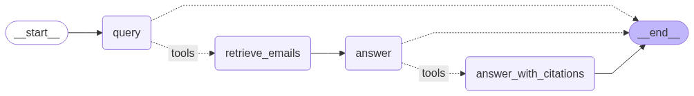

# R-help-chat

[](https://huggingface.co/spaces/jedick/R-help-chat)

Mailing list subscribers often need a search facility to pull up old messages related to a topic of interest.
The R-help mailing list is no exception.
[The R-help Archives](https://stat.ethz.ch/pipermail/r-help/) are publicly available, but search tools are limited and inconsistently maintained (see the [R-help info page](https://stat.ethz.ch/mailman/listinfo/r-help)).
General-purpose AI tools like ChatGPT have knowledge of public mailing lists.
However, list users could benefit from more focused AI-powered search and chat with up-to-date list indexing.

R-help-chat is a chatbot for the R-help archives.
The end-to-end scope of this project includes data processing, email retrieval, conversational RAG, model evaluation, and deployment with a user-friendly web interface.
Domain-specific features for mailing list chatbots, like providing source citations and retrieving whole emails for context, are also included.
Here's a drawing of the graph workflow for one conversational turn:



## Features

- Complete retrieval-augmented generation (RAG) solution built with [LangChain](https://github.com/langchain-ai/langchain)
    - Chain workflow for simple retrieval and response
    - Graph workflow for conversational chat
- Data preprocesssing for email messages
    - Removes quoted lines (starting with ">") for faster indexing and retrieval
- Efficient handling for incremental data updates
    - Only indexes changed files
    - Removes stale documents from vector database
- Multiple retrieval methods for deeper search
    - Dense search with vector embeddings ([Chroma](https://github.com/chroma-core/chroma) vector database)
    - Sparse search ([BM25S](https://github.com/xhluca/bm25s))
    - Hybrid (dense+sparse) search
- Full-context retrieval
    - Each retrieval method provides whole emails (parent documents) for context
    - Dense embedding uses small chunks (child documents) to capture semantic meaning
- Graph workflow implements tool calling, chat memory, and structured responses
    - [Query analysis](https://python.langchain.com/docs/tutorials/qa_chat_history/): Chat model rewrites user's query for retrieval function
    - [Chat memory](https://python.langchain.com/docs/how_to/chatbots_memory/): Previous user and AI messages are part of the context for follow-up questions
    - [Source citations](https://python.langchain.com/docs/how_to/qa_sources/): Model response is structured to cite the sender and date for each answer
- Options for cloud or edge computing to balance performance, price, and privacy
    - Cloud (remote) models: OpenAI API for embeddings and chat model
    - Edge (local) models (*experimental*): [Nomic](https://huggingface.co/nomic-ai/nomic-embed-text-v1.5) embeddings and [SmolLM3](https://huggingface.co/HuggingFaceTB/SmolLM3-3B) chat model
        - Current implementation has relatively low groundedness and accuracy scores

## Web Interface

A Gradio web interface is available for easy interaction with the chatbot:

```sh
python app.py
```

This launches an interactive chat interface in a web browser.
The interface comes with example questions and allows choosing cloud or edge processing and the retrieval strategy.


Go to [Hugging Face Spaces](https://huggingface.co/spaces/jedick/R-help-chat) to try the live app!

## Command-Line Usage

Setup:

- Grab one or more gzip'd files from [The R-help Archive](https://stat.ethz.ch/pipermail/r-help/)
- Extract the files and put them in a folder named `R-help`
- Set your `OPENAI_API_KEY` environment variable (not needed if using edge instead of cloud computing)

Run this Python code to create the vector database:

```python
from main import *
ProcessDirectory("R-help", "cloud")
```

Now you're ready to run the chain or graph workflow. Here are some examples of RAG with the chain workflow:

```python
RunChain("How can I get a named argument from '...'?")
# 'To get a named argument from \'...\', you can use several approaches as discussed in the context. Here are a few methods ...'

RunChain("Help with parsing REST API response.")
# 'The context provides information about parsing a REST API response in JSON format using R. Specifically, it mentions that the response from the API endpoint is in JSON format and suggests using the `jsonlite` package to parse it. ...'
```

Use the graph workflow to allow the chat model to rewrite your query for retrieval and to return the retrieved emails and cited sources.
In this example, the chat model cited 2 out of 6 emails retrieved for the query.

```python
# The console output shows the AI-rewritten query: print line numbers errors
result = RunGraph("How to print line numbers where errors occur?")

result["answer"]
# 'To print line numbers where errors occur in R, you can use the option `options(show.error.locations = TRUE)`. ...'

len(result["retrieved_emails"])
# 5 

result["sources"]
# 'Duncan Murdoch, 2025-01-20; Jeff Newmiller, 2025-01-18'
```

To run evals:

- Set `workflow` to graph or chain
- Set `search_type` to dense, sparse, or hybrid

```sh
python eval.py --compute_mode cloud --workflow graph --search_type hybrid
```

For a fair comparison of different search types, each one retrieves up to 6 emails:

- `dense` or `sparse` (6)
- `hybrid` = `dense` + `sparse` (3 + 3)

## Evaluations

Evals are made for the following LLM-based metrics (see [NVIDIA Metrics in Ragas](https://docs.ragas.io/en/stable/concepts/metrics/available_metrics/nvidia_metrics/) for details) with OpenAI's `gpt-4o-mini` as the judge:

- **Context relevance:** degree to which retrieved context is relevant to the user query
- **Response groundedness:** how well a response is supported by the retrieved context
- **Answer accuracy:** agreement betwen the response and a reference answer

Results for queries and reference answers in `eval.csv` with retrieval from 2.5 years of the R-help archives (January 2022-June 2025):

| Compute | Workflow | Relevance | Groundedness | Accuracy |
|-|-|-|-|-|
| Cloud | Chain | **0.80** | **0.78** | **0.72** |
| Cloud | Graph | 0.62 | 0.60     | 0.65 |
| Edge  | Chain | 0.67 | 0.60     | 0.40 |
| Edge  | Graph | 0.52 | 0.57     | 0.10 |

## Acknowledgments

This project wouldn't be what it is without the codes copied from other projects with local modifications (see `mods` directory). Thank you!

- The retriever class for BM25S (with persistence!) is copied from a [LangChain PR](https://github.com/langchain-ai/langchain/pull/28123) by [@mspronesti](https://github.com/mspronesti)
- Code from [ToolCallingLLM](https://github.com/lalanikarim/tool_calling_llm) adds LangChain-compatible tooling to local Hugging Face models
- LangChain's [LocalFileStore](https://python.langchain.com/api_reference/langchain/storage/langchain.storage.file_system.LocalFileStore.html) was modified to create subdirectories to reduce per-directory file counts.
